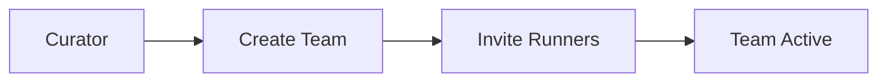
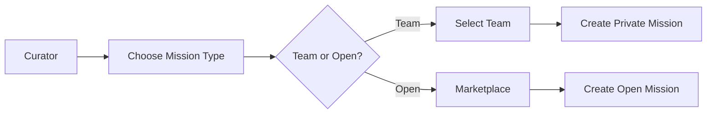
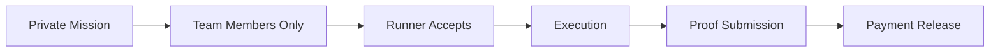

# 🏆 **Special Curator Role: Appointed-Team Mission System**

## 🎯 **Overview**

The **Special Curator Role** enables premium clients and festival bookers to create exclusive, private missions that bypass the open marketplace. Curators can build dedicated teams of runners/DJs and assign missions directly to their team members, ensuring guaranteed execution and quality control.

## 🏗️ **Architecture**

```
Curator → Team Management → Private Missions → Team Assignment → Execution → Payment
   ↓           ↓                ↓                ↓              ↓         ↓
Dashboard   Create/Invite   Team-Only View   Direct Assign   Proof     Release
```

## 👥 **Role Hierarchy**

| Role | Permissions | Description |
|------|-------------|-------------|
| **CURATOR** | Full team & mission management | Premium clients, festival bookers |
| **RUNNER** | Accept missions, submit proof | DJs, performers, service providers |
| **CLIENT** | Create open missions only | Regular mission creators |
| **ADMIN** | All permissions | Platform administrators |

## 🗄️ **Database Schema**

### **Team Model**
```sql
CREATE TABLE teams (
  id TEXT PRIMARY KEY,
  name TEXT NOT NULL,
  description TEXT,
  curator_id TEXT NOT NULL,
  is_active BOOLEAN DEFAULT true,
  created_at DATETIME DEFAULT CURRENT_TIMESTAMP,
  updated_at DATETIME DEFAULT CURRENT_TIMESTAMP,
  FOREIGN KEY (curator_id) REFERENCES users(id)
);
```

### **Updated User Model**
```sql
ALTER TABLE users ADD COLUMN team_id TEXT;
ALTER TABLE users ADD COLUMN role TEXT DEFAULT 'RUNNER';
-- Add CURATOR to role options
```

### **Updated P2P Mission Model**
```sql
ALTER TABLE p2p_missions ADD COLUMN team_id TEXT;
ALTER TABLE p2p_missions ADD COLUMN open_market BOOLEAN DEFAULT true;
```

## 🔐 **RBAC (Role-Based Access Control)**

### **Curator Permissions**
- ✅ `create_team()` - Create new teams
- ✅ `invite_runner_to_team()` - Add runners to teams
- ✅ `remove_runner_from_team()` - Remove team members
- ✅ `create_private_mission()` - Create team-only missions
- ✅ `create_open_mission()` - Create marketplace missions
- ✅ `view_team_analytics()` - Access team performance data
- ✅ `assign_mission_directly()` - Direct mission assignment

### **Runner Permissions**
- ✅ `accept_team_mission()` - Accept missions from their team
- ✅ `accept_open_mission()` - Accept marketplace missions
- ✅ `submit_proof()` - Submit completion proof
- ✅ `leave_team()` - Leave team membership

## 🎛️ **API Endpoints**

### **Team Management**
```javascript
// Get all teams for curator
GET /api/teams

// Create new team
POST /api/teams
{
  "name": "ATL Residency DJs",
  "description": "Premium Atlanta DJ team"
}

// Get team details
GET /api/teams/:id

// Update team
PUT /api/teams/:id

// Invite runner to team
POST /api/teams/:id/invite
{
  "runnerEmail": "dj@example.com"
}

// Remove runner from team
DELETE /api/teams/:id/members/:runnerId

// Get team members
GET /api/teams/:id/members

// Get team missions
GET /api/teams/:id/missions

// Get team analytics
GET /api/teams/:id/analytics

// Leave team (for runners)
POST /api/teams/:id/leave
```

### **Enhanced P2P Missions**
```javascript
// Create mission (supports team assignment)
POST /api/p2p-missions
{
  "title": "Corporate Event DJ",
  "description": "High-end corporate event",
  "budget": 500,
  "deadline": "2024-02-15T18:00:00Z",
  "paymentMethod": "cashapp",
  "teamId": "team_123", // Optional: for team-only missions
  "openMarket": false,  // false = team-only, true = open marketplace
  "requirements": ["Own equipment", "Professional attire"]
}

// Get missions (filtered by team membership)
GET /api/p2p-missions?teamOnly=true
```

## 🎨 **Frontend Components**

### **Curator Dashboard**
- **Overview Tab**: Team statistics and quick actions
- **Teams Tab**: Team management and member invitations
- **Missions Tab**: View all team missions
- **Analytics Tab**: Team performance metrics

### **Enhanced P2P Mission Creator**
- **Mission Type Selection**: Open marketplace vs. Team-only
- **Team Selection**: Choose team for private missions
- **Payment Integration**: Same multi-payment options

### **Enhanced P2P Mission Board**
- **Team Filter**: Toggle between open and team missions
- **Team Badges**: Visual indicators for team missions
- **Access Control**: Only show missions user can access

## 🔄 **Mission Flow**

### **1. Team Creation (Curator)**


### **2. Private Mission Creation**


### **3. Mission Assignment**


## 📊 **Analytics & Reporting**

### **Team Analytics**
- **Member Count**: Active team members
- **Mission Stats**: Status breakdown
- **Total Budget**: Completed mission value
- **Recent Activity**: Latest mission updates

### **Performance Metrics**
- **Completion Rate**: Team vs. marketplace
- **Average Budget**: Team mission values
- **Response Time**: Mission acceptance speed
- **Quality Score**: Based on curator ratings

## 🛡️ **Security & Access Control**

### **Mission Visibility**
```javascript
// Mission filtering logic
const whereClause = {
  OR: [
    { openMarket: true }, // Open marketplace missions
    { teamId: { not: null }, team: { members: { some: { id: userId } } } }, // User's team missions
    { teamId: { not: null }, curatorId: userId } // Curator's own team missions
  ]
}
```

### **Team Access Control**
- Only curators can create and manage teams
- Only team members can see team missions
- Curators can only manage their own teams
- Runners can only join teams they're invited to

## 🎯 **Use Cases**

### **Festival Bookers**
- Create dedicated DJ teams for events
- Assign specific time slots to team members
- Ensure consistent quality across events
- Direct communication with performers

### **Corporate Clients**
- Build trusted vendor relationships
- Create recurring event teams
- Maintain brand consistency
- Streamlined booking process

### **Venue Managers**
- Establish resident DJ programs
- Create house music teams
- Manage multiple locations
- Quality control and consistency

## 🚀 **Implementation Guide**

### **1. Database Migration**
```bash
# Run Prisma migration
npx prisma migrate dev --name add_curator_teams
```

### **2. Role Assignment**
```javascript
// Assign curator role to user
await prisma.user.update({
  where: { id: userId },
  data: { role: 'CURATOR' }
})
```

### **3. Team Creation**
```javascript
// Create team
const team = await prisma.team.create({
  data: {
    name: "Premium DJ Team",
    description: "High-end event performers",
    curatorId: curatorId
  }
})
```

### **4. Mission Creation**
```javascript
// Create team-only mission
const mission = await prisma.p2pMission.create({
  data: {
    title: "Corporate Gala DJ",
    budget: 1000,
    teamId: teamId,
    openMarket: false,
    curatorId: curatorId,
    // ... other fields
  }
})
```

## 📈 **Benefits**

### **For Curators**
- ✅ **Guaranteed Execution**: Direct team assignment
- ✅ **Quality Control**: Vetted team members
- ✅ **Streamlined Process**: No marketplace competition
- ✅ **Relationship Building**: Long-term partnerships
- ✅ **Analytics**: Performance tracking

### **For Runners**
- ✅ **Steady Work**: Regular team assignments
- ✅ **Higher Pay**: Premium team rates
- ✅ **Direct Communication**: Clear expectations
- ✅ **Professional Growth**: Team collaboration
- ✅ **Reputation Building**: Curator endorsements

### **For Platform**
- ✅ **Premium Revenue**: Higher-value transactions
- ✅ **User Retention**: Long-term relationships
- ✅ **Quality Assurance**: Curated experiences
- ✅ **Market Differentiation**: Exclusive offerings
- ✅ **Scalability**: Team-based operations

## 🔮 **Future Enhancements**

### **Advanced Features**
- **Team Scheduling**: Calendar integration
- **Performance Ratings**: Team member scoring
- **Automated Assignments**: AI-powered matching
- **Team Chat**: Direct communication
- **Revenue Sharing**: Team commission splits

### **Integration Opportunities**
- **Calendar Systems**: Google Calendar, Outlook
- **Payment Processors**: Stripe, PayPal Business
- **Communication Tools**: Slack, Discord
- **Analytics Platforms**: Google Analytics, Mixpanel

---

**🎵 The Special Curator Role transforms Club Run from a marketplace into a comprehensive music servicing platform, enabling premium experiences and guaranteed quality for high-value events.**
